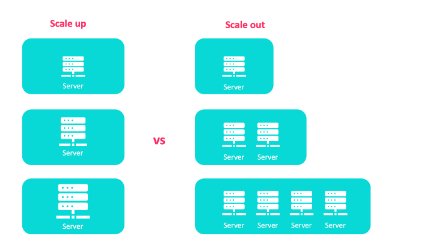
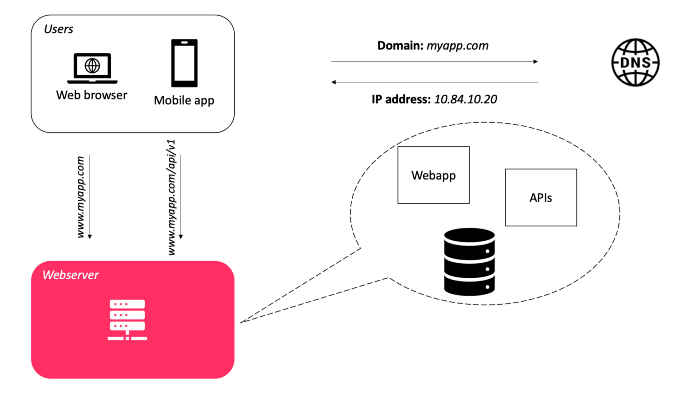

# SCALING

software architect challenge: design a system that supports hundreds of millions of users

Scale when 
- incresed data volume
- increased amount of work (transactions)
- grown users

- Function are the unit of deployment and scaling.
- Apply microservice architecture pattern in the later stages of development, when scaling becomes the most important issue
- scalability can either be 
    horizontal (scaling the network with high performance nodes) 
    vertical (scaling each node by increasing individual performance )

***SCALABLE*** (unlimited capacity of processing/storage)

ART OF SCABILITY: scaling out, scaling up.

Scalability: ability to handle more users, clients, data, transactions, requests without affecting the user experience by adding more resources.

- TO SCALE UP: means adding more RAM, more CPU — more resources, to the existing hardware in which your system runs; but you are still constrained to a single “box”
Is `vertical scalability`: scaling each node by increasing individual performance  
Resource maximization of a system to expand its ability to handle the increasing load

Adding more I/O capacity by adding more hard drives in RAID arrays.
Improving I/O access times by switch to solid-state drivers (SSDs).
Switching to a server with more processors.
Improving network throughput by upgrading network interfaces or installing additional ones.
Reducing I/O operations by increasing RAM.
Vertical scaling is a good option for small systems and can afford the hardware upgrade but it also comes with serious limitations as follows.
“It’s impossible to add unlimited power to a single server”. It mostly depends on the operating system and the memory bus width of the server.
When we upgrade RAM to the system, we must shut down the server and so, if the system just has one server, downtime is unavoidable.
Powerful machines usually cost a lot more than popular hardware.
Scaling up not only applies to hardware terms but also in software terms, for example, it includes optimizing queries and application code.

- TO SCALE “OUT”: means you can just add a brand new machine, generally to a “cluster” of some sort, that allows your system to much more easily add additional resources.
With all the cloud services, containerization, and VMs readily available in today’s world, it can be extremely simple to spin up and down resources as necessary. Just add a new node to the cluster!
Is `Horizontal scalability`: scaling the network with high performance nodes. add more entities (machines, services) to our pool of resources  
add any number of hardware and software entities
It’s harder to achieve horizontal scaling than vertical scaling since we need to consider it before the system is built.
Increasing the number of servers means that more resources need to be maintained.
The code of the system also needs changes to allow parallelism and distribution of work among multiple servers.

    

## Old classical architecture

CONS:
- If the database fails, the system fails.
- If the webserver fails, the entire system fails.

download.page(cloud/cloud_scaling_load_balancer.md)
download.page(cloud/cloud_scaling_database.md)

### Scaling a relational database
- master-slave replication
- master-master replication
- federation
- sharding
- denormalization
- SQL tuning

### Which database to use: NoSQL or SQL?

### Advanced concepts: caching, CDN, geoDNS., etc.

- https://levelup.gitconnected.com/how-to-design-a-system-to-scale-to-your-first-100-million-users-4450a2f9703d