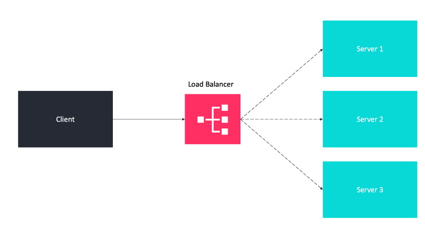

### load a balancer

Use load a balancer to balance the traffic across all nodes

A load balancer is a specialized hardware or software component that helps to spread the traffic across a cluster of servers to improve responsiveness and availability of the system (include but not limited to applications, websites, or databases).

Distributes the traffic across multiple backend servers using various algorithms. So, 

it can be used in various places
- between the client and the server
- between the Web Servers and the Database servers
- between the Client and the Web Servers.
HAProxy and NGINX are two popular open-source load balancing software.

The load balancer technique is a fault tolerance assurance methodology and improves availability as follows.
If server 1 goes offline, all the traffic will be routed to server 2 and server 3. The website won’t go offline. You also need to add a new healthy server to the server pool to balance the load.
When the traffic is growing rapidly, you only need to add more servers to the web server pool and the load balancer will route the traffic for you.

Load balancers policies and work distribution algorithms to optimally distribute the load as follows.

- Round robin: in this case, each server receives requests in sequential order similar in spirit to First In First Out (FIFO).
- Least number of connections: the server with the lowest number of connections will be directed to the request.
- Fastest response time: the server that has the fastest response time (either recently or frequently) will be directed to the request.
- Weighted: the more powerful servers will receive more requests than the weaker ones underweighted strategy.
- IP Hash: in this case, a hash of the IP address of the client is calculated to redirect the request to a server.

The most straightforward way to balance requests between multiple servers is to use a hardware appliance.
Adding and removing real servers from shared IP happens instantly.
Load balancing can be done as desired.

Software load balancing is a cheap alternative to hardware load balancers. It operates at layer 4 (network layer) and layer 7 (application layer).
Layer 4: the load balancer uses the information provided by TCP at the network layer. At this layer, it usually selects a server without looking at the content of the request.
Layer 7: the requests can be balanced based on information in the query string, cookies, or any header we choose as well as the regular layer information including source and destination addresses.

- https://itnext.io/how-to-use-database-sharding-and-scale-an-asp-net-core-microservice-architecture-22c24916590f