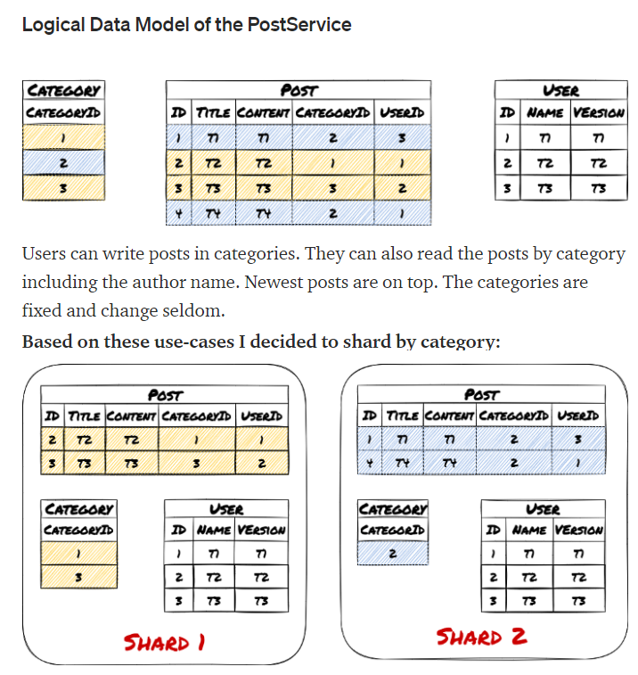

## DATABASE SHARDING

* **Sharding**: breaking up our data into chunks (shards)
* **Sharding Benefit**: allows database to scale for large-scale systems
* **Implementation**
    - **at application level**, code determine which database shard is to be read or written to
    - **as a native feature** of your database. MongoDB supports sharding out of the box

### Key-based sharding
Select and hash a specific unique column, resulting hash is used to determine a shard that the read or write operation needs to go into.
For example, if we are trying to access User A’s profile, which has a user id user123, then we first hash this. Let's say we obtain a simplistic value of 100. We can now use the modulo operation on this value based on the number of shards we have. If we have seven shards, then 100 % 7 = 2. Our read operation will hit Shard 2.
This simple hash-based sharding helps us to consistently direct our entries to the respective shards.

* Range-based sharding
Create ranges for our entries  
All customers with names starting with A to L will go into Shard 1 and the rest goes into Shard 2.  
We will just keep a hash table (a mapping) to capture this logic of what goes where. When a request comes, we check the name of our customer and determine the respective shard we need to hit.

* Consistent hash sharding
One of the common issues with key-based sharding is that if the number of shards or database servers we have changes, then we need to remap all entries. To lessen the workload when the number of database servers changes, we can use the consistent hashing mechanism. This will only require us to remap n/m number of keys, where n is the number of keys and m is the number of servers. Consistent hashing is an entire topic of its own, and we will avoid going into too much detail here. To understand more, you can read this great Toptal article.

- https://betterprogramming.pub/what-exactly-is-database-sharding-ca618a2cbb9a

- [application-layer sharding with shard key](https://itnext.io/how-to-use-database-sharding-and-scale-an-asp-net-core-microservice-architecture-22c24916590f)

  "PostDbConnectionStrings": {
    "Shard0": "server=localhost; port=3310; database=post; user=root; password=pw; Persist Security Info=False; Connect Timeout=300",
    "Shard1": "server=localhost; port=3311; database=post; user=root; password=pw; Persist Security Info=False; Connect Timeout=300"    
  }
}