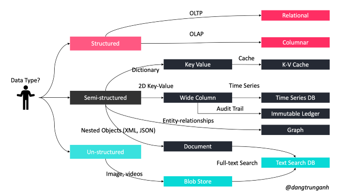

# DATABASES

## History
* 1970 Relational model: SQL
    Not for high volumes (slow responses, heavy and complex data distribution)
    Ex: Sql Server, Oracle, MySQL
    +
        Rules for data coherence
        Locks for concurrents access
        ACID respect (Atomic Coherent Isolation Durable)
        Tools to modelise
    -
        Less performance when volume increase
        Data distribution of a base problems

* 2000 NoSQL - Not Only SQL
    For high volumes (Google, Facebook)
    Ex: MongoDB, Cassandra, CouchDB, DynamoDB
    NoSQL is a form of unstructured storage, NoSQL databases do not have a fixed table structure like the ones found in relational databases.

|Feature|      NoSQL Databases |			Relational Databases|
|---|---|---|
|Performance| 		High|						Low|
|Reliability| 		Poor|						Good|
|Availability| 		Good|						Good|
|Consistency| 		Poor|						Good|
|DataStorage| 		Optimized for huge data|		Medium sized to large|
|Scalability| 		High|						High (but more expensive)|

### SCHEMA
Collection of database objects including tables, views, triggers, stored procedures, indexes, types, interfaces, enums, unions...taht make up your application data model
Organize the database objects into logical groups to make them more manageable. Also, schema can be treated as a dictionary with all the information objects of the database.
>SELECT * FROM information_schema.columns; Or we can choose to see the schema for a specific table,
>SELECT * FROM information_schema.columns WHERE table_name = 'boats';

### INDEXES
To access directly to the requested data = book's table of content: word ←→ page
No need to browse all the pages to find a word

Indexing is the process of associating a key with the location of a corresponding data record in a DBMS. 
### INDEX TYPES

* PRIMARY   unique, one per table
* UNIQUE    unique, no two rows have the same combination of the values
* INDEX     may not be unique, but improves lookup efficiency
* FULLTEXT  Create an index for each word in that column for full text search

PRIMARY KEY, UNIQUE, INDEX, and FULLTEXT are stored in B+trees
spatial data types use R-trees;

## Rules to bring the database fully into best development practices:
***Critical databases should have at least one staging environment***
Keep staging as production-like as possible
Automate refresh/reset of staging environment as much as possible
Monitor staging environment fully, use staging to validate monitoring and configuration changes just like code changes
Use production datasets in staging
Minimal permissions with automatic permission escalation for developers in staging

***Development and test environments should be ephemeral***
Dev and test environments should mimic production datasets (to an extent—see below), but NOT production availability techniques
In the case when deployment order of changes is unknown or is potentially unpredictable, test environments should be able to be re-generated so that changes can be easily and quickly re-applied in the expected order following the re-shuffle. 

***“Safe” datasets should be available for dev and test environments***
No matter how you architect your dev and test environments, if they contain Personally Identifying Information or other sensitive data, you are putting your business at risk. Development and Test environments are an attractive target for a data breach.

However, you implement a modern architecture for your dev and test databases, it is important that the source of the data you use – be it the source of a snapshot, a database “image”, or something else – contains data which has been sanitized in some way to limit the risks of a data breach.

***Developers should have full control/ high permissions over dev and test environments***
User Acceptance Testing (UAT) environments?
User Acceptance Testing environments are common. UAT environments allow customers to review new features prior to deployment to production.
UAT environments are quite different from Staging environments. The goal is often to allow a simple interaction with a new feature and NOT to present a production-like experience.

The ability to generate UAT environments on the fly is very useful. This eliminates maintenance and support when the environment is not in use, and also allows generating multiple environments when needed if that is helpful.

download.page(data/database-sharding.md)