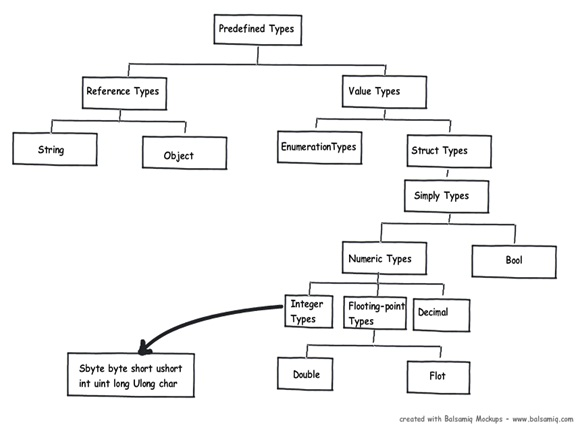
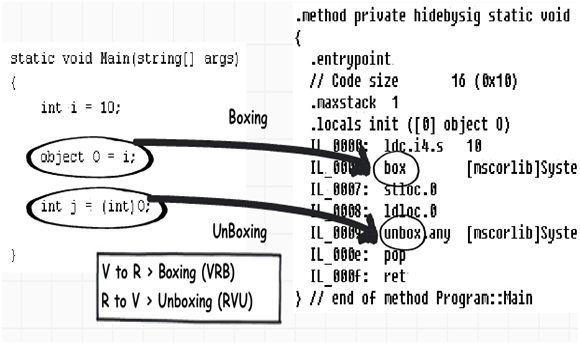

# Types

In .NET, depending on the data type, the variable is either assigned on the stack or on the heap.

## REFERENCE TYPES
class keyword 
Allocated on heap 
A variable for a reference type is a reference to the thing on the heap 
Passed around by reference 
Assignment is a copy Of the reference. Not the Object 

## VALUES TYPES
Struct keyword 
Allocated on stack 
>Or embedded into a reference object
A variable for a value type is the value itself. e.g. integer. 3D point. etc. 
Passed around by value (i.e. copied) 
Assignment is a copy of the whole value 

## HEAP VS STACK
The heap is general purpose memory 
>Lasts for the lifetime of the applicatson 

The stack is a block of memory for data required by methods   
Each method pushes space onto the stack for local variables   
Pops the stack on method exit   
>Stack allocation is the the for the lifetime of the method
 
Value types are the whole data, so live directly on the stack 
`stackalloc` keyword allows creating blocks of memory on the stack 
Allocation and cleanup is cheap, but limited space 

***REFERENCE TYPES***
`class, array, delegate, interface, object, string`

class keyword 
Allocated on heap 
A variable for a reference type is a reference to the thing on the heap 
Passed around by reference 
Assignment is a copy of the reference, not the object 

***VALUE TYPES***
`struct, enum, bool, int, char, float, double, decimal`

struct keyword 
Allocated on stack (or embedded into a object)
A variable for a value type is the value itself, e.g. integer, 3D point. etc. 
Passed around by value (i.e. copied) 
Assignment is a copy of the whole value 

***Boxing***
Creates an object (on the heap) representing a value type. Boxing happens whenever a struct is cast either to object, or any other interface. There’s an explic it OpCode box in .NET IL

Boxing: When the data moves from value types to reference types
UnBoxing: When the data moves from reference types to value types

- Passing value types to method expecting a reference type
- Creates a new object on the heap (box) that contains a copy of the value type
- Any changes to the boxed value doesn't affect the original

download.page(dotnet/types/heap_stack.md)

***PREDEFINED TYPES = BUILT-IN TYPES***
int, char, float, double, decimal, bool, struct, enum, string, object

using System;
Important types not defined in C#
Contains the most .Net framework types (DateTime...)

***DISCOVER PROPERTIES, METHODS...***
'w32time' | Get-Member   
$CustomObject = [pscustomobject]@{ Name = 'w32time' }
$CustomObject | Get-Member
 
int i = 5;
string s = "Hello";
double d = 1.0;
int[] numbers = new int[] {1, 2, 3};
int[] numbers = { 1, 3, 5, 7, 9 };
foreach (var n in numbers) Console.WriteLine(n);
Dictionary<int,Order> orders = new Dictionary<int,Order>();

Range(0, 6).Select(i => ...)

download.page(dotnet/types/default_values.md)

          
::::
download.page(dotnet/types/ref/interfaces.md)
::::
download.page(dotnet/types/ref/string.md)
::::
download.page(dotnet/types/ref/delegates.md)
::::
download.page(dotnet/types/ref/class.md)
::::
download.page(dotnet/types/ref/dynamic.md)
::::
download.page(dotnet/types/ref/record.md)
::::
download.page(dotnet/language/covariance.md)
::::
download.page(dotnet/types/val/structs.md)
::::
download.page(dotnet/types/val/range.md)
::::
download.page(dotnet/types/val/span.md)
::::
download.page(dotnet/types/val/memory.md)
::::
download.page(dotnet/types/val/json.md)
::::
download.page(dotnet/types/ref/null.md)
::::
download.page(dotnet/types/monads.md)