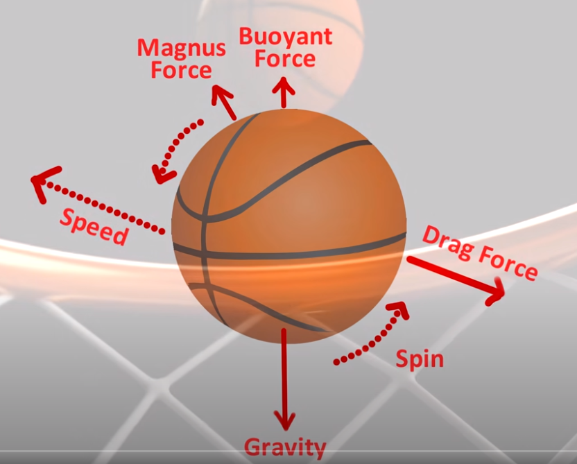

# NEWTON LAWS

## Newton's laws (principle of motion)

Foundation of classical mechanics
Newton’s laws are verified by experiments but they can not be demonstrated theoretically (mathematically).
All Newton’s laws of motion are defining the force from three different perspectives: the first law defines the impact of a force on a body (qualitative definition), the second law defines the value of the force (quantitative definition), and the third law states that a single isolated force can not exist.

### 1st law: inertia principle
An object keeps its state as long as there is no force which acts upon it. The state of the body can be either stationary or moving with constant speed.
An object with a mass will maintain its status quo, unless there is a force which will act on it.
 
### 2nd law: force’s action principle
F=m.a   
Force equals mass times acceleration. If you apply a force to a fixed mass, it tells you how much acceleration you will get. And knowing acceleration which is the change in velocity, you can make predictions.
Resultant force F [N] acting on a body is product between the mass m [kg] and the body’s acceleration a [m/s²].

F = m.a = 80Kg.9.8m/s² = 784 N
1 N = 1 apple in your hand = 0.102Kg.9.8m/s² = 1 N
average apple is between 70 and 100 grams = 07-1N

Force is defined as the change in time of the `momentum p [kgm/s]`:
p=m.v
F=dp/dt=d(m.v)/dt=m.dv/dt=m.a

### 3rd law: action and reaction principle
If a given body exerts a force on a second body, the second body will exert in the same time a force equal in magnitude and opposite in direction on the first body.

### LAW OF UNIVERSAL GRAVITATION

F = G M1 M2/ d²
it allows us to determine the motion of heavenly bodies. It says that the gravitational attraction between two bodies is the product of their masses divided by the distance between them squared, times a constant, called Newton’s gravitational constant. 

### More
https://x-engineer.org/undergraduate-engineering/physics/solid-mechanics/how-to-calculate-friction-force/

