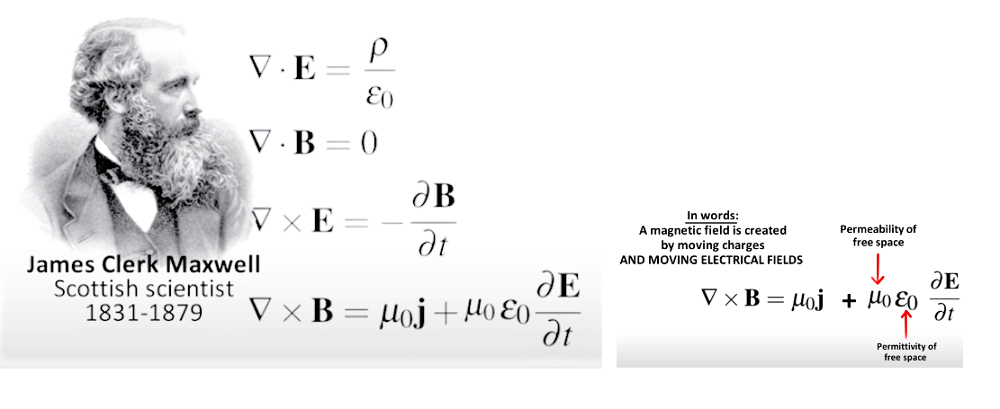

# MAXWELL EQUATIONS

 If you have a static object with a charge, it will affect only other charges. 
 
 If you have a static magnet, it will affect only other magnets. It will not affect charges. But if you have a moving charge, it will affect a magnet. 
 
 If you have a moving magnet, it will affect a charge. 
 
A magnetic field is created by moving charges AND MOVING ELECTRICAL FIELDS

 The constants mu naught and epsilon naught are the permeability and permittivity of free space. These two constants determine the speed of light because they measure the resistance of space to changing electric and magnetic fields.