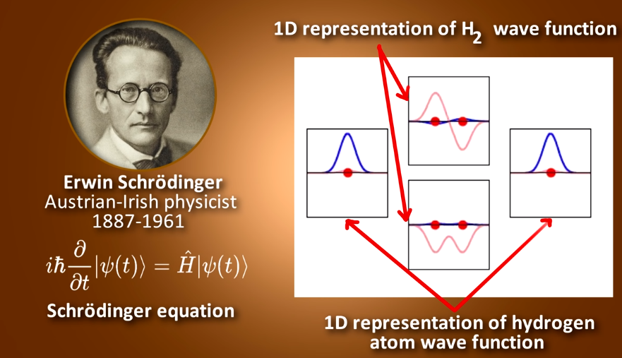

# schrodinger equation

L'équation fondamentale de la mécanique quantique est l'équation de Schrödinger.

Prior to measurement, quantum systems are in superposed states. This means that their properties can only be expressed as a wave function. A wave function simplified, is a set of probabilities. So in a hydrogen atom, you can’t know where to find the electron in advance. All you can know is the probability of where you might find it, if you measured it. Prior to measurement, all quantum systems are waves of probabilities. This is not a limitation of our measuring devices. It is a limitation of reality.

LE CHAT DE SCHRÖDINGER
Le physicien Schrödinger a utilisé une image devenue célèbre pour mettre en avant le côté paradoxal ***d’objets dont on ne peut pas connaître l’état à tout moment***. Il a imaginé un chat « quantique », enfermé dans une boîte sans fenêtre en présence d’un poison déclenché par un processus quantique. Tant que la boîte n’est pas ouverte, on ne sait pas si le processus quantique a déclenché le mécanisme, le chat est à la fois mort et vivant avec des probabilités dépendant du processus. Bien sûr, quand on ouvre la boîte le chat est soit mort, soit vivant. En regardant à l’intérieur, on fait une mesure qui nous permet de connaître l’état quantique du système.

