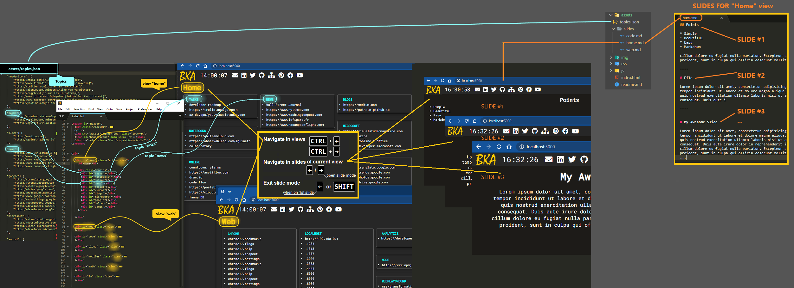
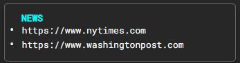
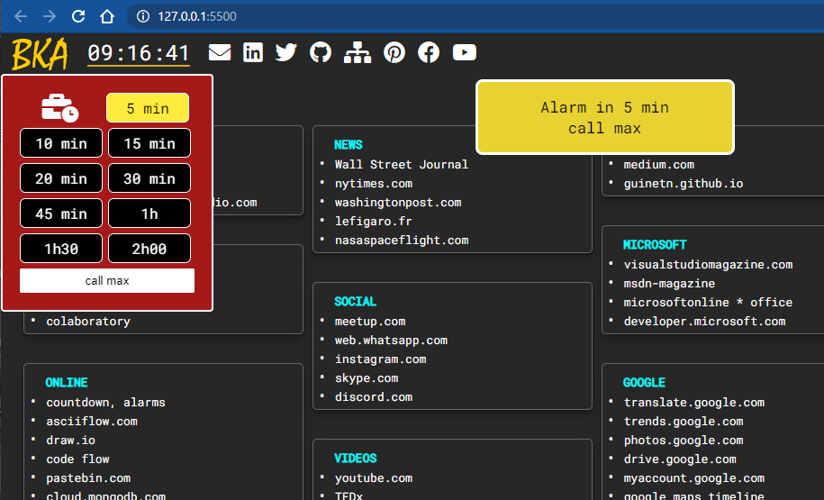

# Brain cache

  
Never open you're .md notes again, it's automatic and as fast as your fingers can move.  


# Features
* Navigate in views   
* Navigate in view's slides 
* Set alarms
* Customize & enrich: add views, topics, links, slides to views
* Fullscreen mode
* Automatic repeat copy when mousedown > 3sec

|Key|Action|  
|---|---|  
|<kbd>CTRL</kbd><kbd>→</kbd> or <kbd>+</kbd><br/><kbd>CTRL</kbd><kbd>←</kbd> or <kbd>-</kbd>  | Navigate in views|   
|<kbd>a…z</kbd> key | Go to view with a name starting by…|  
|<kbd>→</kbd> | Start slides navigation for current view|  
|<kbd>←</kbd> <kbd>→</kbd> | Navigate in slides of the current view|   
|<kbd>SHIFT</kbd><br>or <kbd>←</kbd> on 1st slide | Exit slide navigation<br>Slide page is memorized: come back to it with <kbd>→</kbd> |  
|<kbd>F</kbd> key | Fullscreen mode|  
|<kbd>ESC</kbd> key | Exit Fullscreen mode|  

# Configuration



### Use from server side
1. Clone-it on github  
2. Activate the github page  
2. Link it to your browser's homepage  (or as a bookmark)
>chrome::settings  
>└──Appearance  
>└────Welcome button  
>└─────Set this repo as you're browser homepage

### Use locally
1. Clone-it locally then starts a server…
2. npm i -g serve
3. cd <...repo...>
4. serve
5. http://localhost:5000

# Customize

Refer to bka_config.png for a global view of the process.

## Adding a view

* View contains topics (grouped links) or custom html  
* Views are defined inside &lt;div id="main"&gt; in index.html
* Each view can have a markdown file (.md) in assets/slides

***Empty view***     
```html
 <div id="Name_Of_My_View" class="view">  ← Change 'Name_Of_My_View'
    <h1>Title_Of_My_View</h1>             ← Change (or remove the h1) 'Title_Of_My_View'
    <div class="topics">                   
       ...add topics here     
    </div>
    ...add any other html content here
</div>
```
***Add topics***   

```json
Topics are defined in assets/topics.json

…
"news": [		
		"https://www.nytimes.com",
		"https://www.washingtonpost.com"		
        ], 
…
```
***Connect topic to view***
```html
 index.html

 <div id="Name_Of_My_View" class="view">
    <h1>Title_Of_My_View</h1>           
    <div class="topics">   
       <div id="news"></div>   ← This is how to inject the topic 'news' in a view. In the topic title, char _ will be replaced by a space  
    </div>                        Ex: "Productivity_Tools" → "Productivity Tools"   
</div>

an unique option: 
 
    <div class="topics">   
       <div id="news" data-info='-t'></div>   ← '-t' will remove the topic's title (it display the links 'inline', you won't see the 'News' in aqua color below)
    </div>    
```
***Result***  
      

> You can change colors in ```css/index.css```

***Topics options***  
* Replace links by a friendly name
* Add icons from [fontawesome](https://fontawesome.com/icons?d=gallery)

```json
"news": [		
		"https://www.nytimes.com",                      ← Display "https://www.nytimes.com"  
		"https://www.nytimes.com(THE NY TIMES)",        ← Display "THE NY TIMES"
        "https://www.nytimes.com[fas fa-newspaper]",  ← Display an icon
        "https://www.nytimes.com[inline fab fa-newspaper]",  ← To have icon inline (no rows)..hmm buggy
        "https://www.washingtonpost.com"		
        ], 
…	
```
## Adding slides to a view...takes 10 sec

Just create a .md file having the same name of the view in ```assets/slides```

* Each view can have a markdown file (.md) 
* This .md file is converted in html on the fly when you press <kbd>→</kbd>     
* The sequence '----' is the slide separator. Slides are not limited in size.  
* Slides can contains youtube video (and kind of by extension):

```md
home.md

Slide 1.
# My Awesome Slide #1

lorem.........  
  
How to add an image with the right path to:


----
Slide 2.

### Add a video
<iframe src="//www.youtube.com/embed/I0eVwo1VCuU?rel=0" frameborder="0" allowfullscreen></iframe>


### Add a markdown file   
download.md(assets/slides/code.md)

### Add raw data   
download.div(https://raw.githubusercontent.com/mortennobel/cpp-cheatsheet/master/cheatsheet-as-sourcefile.cpp)

### Add a code file  
download.code(https://raw.githubusercontent.com/mortennobel/cpp-cheatsheet/master/cheatsheet-as-sourcefile.cpp)

Lorem ipsum dolor sit amet, consectetur adipisicing elit, sed do eiusmod
tempor incididunt ut labore et dolore magna aliqua. Ut enim ad minim veniam,
quis nostrud exercitation ullamco laboris nisi ut aliquip ex ea commodo
consequat. Duis aute irure dolor in reprehenderit in voluptate velit esse
cillum dolore eu fugiat nulla pariatur. Excepteur sint occaecat cupidatat non
proident, sunt in culpa qui officia deserunt mollit anim id est laborum.

----     ← Slides separator. Slides are not limited in size.

## My better Slide #2
**"abcdef"** is a tool to create a simple and beautiful slide
…
----
…

```

# Alarms

* Audio (speaker)
* Visual message



* Click the clock  
* Optionally enter a text in relation to the alarm  
* Click a duration  
* To close the alarm selection, click the clock again or somewhere in the red square  
* A progressbar is displayed below the clock  
* Now, wait for the speaker and the snackbar!

***Cancelling an alarm***  
* Click the clock  
* Click the duration with a yellow background 

# Development

> git clone ...  
>cd <my_folder>  
>Start a server: 
>* serve (npm i -g serve)   
>* or live-server from vs code…  


# License
Released under the [MIT License][http://www.opensource.org/licenses/MIT]